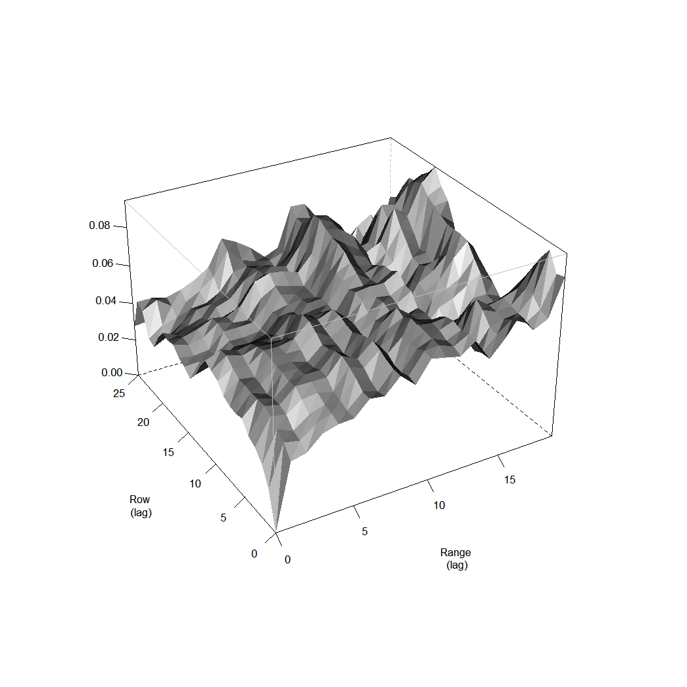
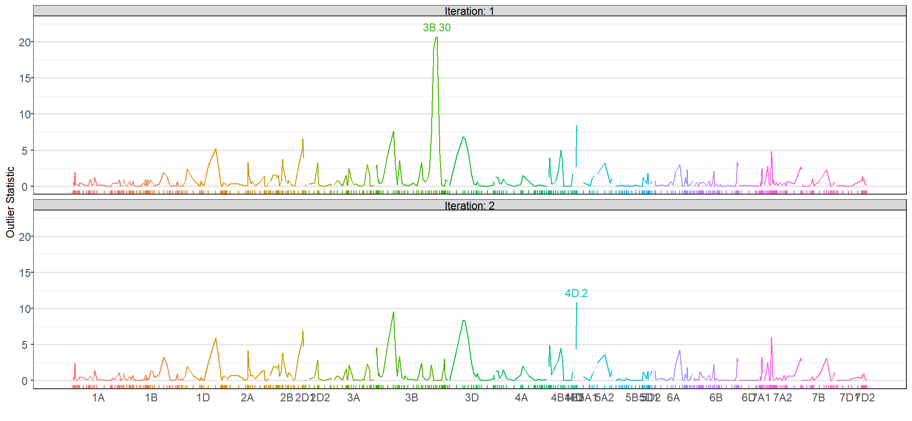
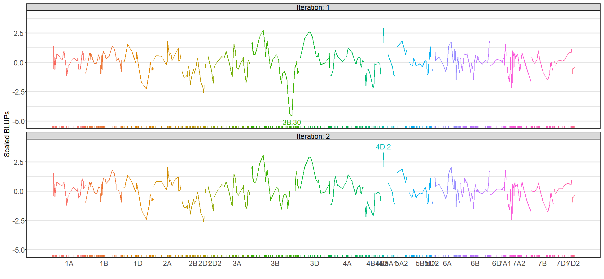

Welcome to version 2.0.x of the **wgaim** R package! This package is an
implementation of the whole genome average interval mapping (WGAIM) QTL analysis
algorithm discussed in @ver07 and @vt12. Although slightly out of date, the
definitive reference for this software is @tv11jss with full reference given as

<br>

Taylor, J. and Verbyla, A (2011) R package **wgaim**: QTL Analysis in Bi-Parental
Populations using Linear Mixed Models, *Journal of Statistical Software*, **40**(7).

<br>

*Note: The QTL analysis functions in **wgaim**
explicitly use and build upon the functionality provided by the linear mixed
modelling **ASReml-R** package (currently version 4). This is a commercial
package available from VSNi at https://www.vsni.co.uk/software/asreml/ with pricing dependent on the
institution. Users will require a fully licensed version of **ASReml-R** to use
the QTL analysis functionality of the **wgaim** package and to run the code in this
vignette. Users should consult the **ASReml-R** documentation for thorough details on the model
syntax and extensive peripheral features of the package.*

This introductory vignette presents the workflow of a **wgaim** QTL analysis. More in
depth analyses can be found in an upcoming sister vignette, "A deeper look at
the **wgaim** functionality." The analysis workflow can be summarised simply with three
steps:

1. With phenotypic data, build a base linear mixed model using the functionality
   of **ASReml-R**.
2. Construct a genotypic linkage map, store it as a **qtl** cross object and
   convert it to a **wgaim** interval object.
3. Use the base model from  1. and the interval genotype object from 2. to conduct a
   **wgaim** QTL analysis.

**Package restrictions**: The current version of **wgaim** provides
  functionality for QTL analysis of Double Haploid, Backcross, Advanced
  Recombinant Inbred and F2 populations.

## Package data

The **wgaim** package contains several pre-packaged phenotypic data sets with matching
genetic linkage maps ready for QTL analysis.


```text
data(package = "wgaim")
```

The data has also been placed in a second location to provide the ability to
read in manually.


```text
wgpath <- system.file("extdata", package = "wgaim")
list.files(wgpath)
```

```
## [1] "genoCxR.csv"  "genoRxK.csv"  "genoSxT.csv"  "phenoCxR.csv"
## [5] "phenoRxK.csv" "phenoSxT.csv"
```

## Example: RAC875 x Kukri phenotypic and genotypic data

### Phenotypic data and base model

This example consists of phenotypic and genotypic data sets involving a Doubled
Haploid (DH) population derived from the crossing of wheat varieties RAC875 and
Kukri [@bon12]. The main goal of the experiment was to find causal links between
grain yield related traits and genetic markers associated with the population.


```text
data(phenoRxK, package = "wgaim")
head(phenoRxK)
```

```
##     Genotype Type Row Range Rep    yld  tgw  lrow lrange
## 1    DH_R003   DH   1     1   1 2.2384 33.4 -12.5   -9.5
## 40   DH_R055   DH   2     1   1 1.1576 31.6 -11.5   -9.5
## 41   DH_R056   DH   3     1   1 1.6424 48.3 -10.5   -9.5
## 80   DH_R111   DH   4     1   1 2.3991 31.6  -9.5   -9.5
## 81   DH_R112   DH   5     1   1 1.9744 33.4  -8.5   -9.5
## 120  DH_R170   DH   6     1   1 1.2741 26.3  -7.5   -9.5
```

The RAC875 x Kukri phenotypic data relates to a field trial consisting of 520
plots. Two replicates of 256 DH lines (`Genotype`) from the RAC875 x Kukri population were
allocated to a 20  `Row` by 26 `Range` layout using a randomized complete block design with 2
Blocks (`Rep`). The additional plots remaining in each block were filled with
one of each of the parents and controls (ATIL, SOKOLL, WEEBILL). A `Type` factor is included
to distinguish the set of DH lines from each of the parents and controls. `lrow` and `lrange`
are numerically encoded and zero centred row and range covariates. A number of yield related
trait measurements were collected including grain yield (t/ha) (`yld`) and thousand
grain weight (`tgw`).

The analysis in this vignette concentrates on grain yield (`yld`). Before
using the QTL analysis functions in **wgaim**, an appropriate initial base **ASReml-R**
linear mixed model needs to be built and fitted.


```text
rkyld.asi <- asreml::asreml(yld ~ Type, random = ~ Genotype + Rep, residual =
     ~ ar1(Range):ar1(Row), data = phenoRxK)
```

```
## Model fitted using the gamma parameterization.
## ASReml 4.1.0 Mon Aug 26 14:47:40 2019
##           LogLik        Sigma2     DF     wall    cpu
##  1       128.285      0.202517    514 14:47:40    0.0
##  2       178.124      0.126231    514 14:47:40    0.0
##  3       211.555      0.086862    514 14:47:41    0.0
##  4       221.240      0.074148    514 14:47:41    0.0
##  5       222.515      0.071463    514 14:47:41    0.0
##  6       222.595      0.072380    514 14:47:41    0.0
##  7       222.606      0.072730    514 14:47:41    0.0
##  8       222.607      0.072856    514 14:47:41    0.0
```

The focus of this model is the accurate calculation of the
genetic variance of the DH progeny using `Genotype`. This accuracy is
dramatically enhanced through the addition of terms used to account for
extraneous variation arising from the experimental design (random term `Rep`) as
well as potential correlation of the observations due to the similarity of
neighbouring field trial plots (separable residual correlation structure
`ar1(Row):ar1(Range)`)[@ver07; @gil07]. Additionally, the inclusion of a `Type`
factor as a fixed effect ensures the random `Genotype` factor only contains
non-zero effects for the DH progeny.

A summary of the models variance parameter estimates shows a moderate
correlation exists in the Range direction with a small correlation existing
across the Rows.


```text
summary(rkyld.asi)$varcomp
```

```
##                       component   std.error    z.ratio bound %ch
## Rep                 0.001733554 0.003934291  0.4406269     P 0.7
## Genotype            0.167952916 0.017092886  9.8258958     P 0.0
## Range:Row!R         0.072856232 0.007130535 10.2174994     P 0.0
## Range:Row!Range!cor 0.240159289 0.068828138  3.4892603     U 0.3
## Range:Row!Row!cor   0.506495872 0.048864188 10.3653798     U 0.1
```

**ASReml-R** provides functionality for diagnostically checking the linear mixed
model residuals. The variogram of the residuals indicates there is potential trends in the
row and range directions of the experimental layout.


```text
plot(asreml::varioGram.asreml(rkyld.asi))
```



A faceted plot of the residuals confirm these trends.


```text
phenoRxKd <- cbind.data.frame(phenoRxK, Residuals = resid(rkyld.asi))
ggplot(phenoRxKd, aes(y = Residuals, x = as.numeric(Range))) + facet_wrap(~ Row) +
    geom_hline(yintercept = 0, linetype = 2) + geom_point(shape = 16, colour = "blue") +
    xlab("Range") + theme_bw()
```


To account for these trends, terms `lrow` and `Range` are added to the fixed and
random components of the `asreml` model and the model is refitted. An `lrange`
fixed term would also be a suitable alternative to the random `Range` term.


```text
rkyld.asf <- asreml::asreml(yld ~ Type + lrow, random = ~ Genotype + Range, residual =
     ~ ar1(Range):ar1(Row), data = phenoRxK)
```

```
## Model fitted using the gamma parameterization.
## ASReml 4.1.0 Mon Aug 26 14:47:46 2019
##           LogLik        Sigma2     DF     wall    cpu
##  1       130.554      0.189858    513 14:47:47    0.0
##  2       182.276      0.113102    513 14:47:47    0.0
##  3       214.329      0.074662    513 14:47:47    0.0
##  4       223.385      0.060682    513 14:47:47    0.0
##  5       224.625      0.055965    513 14:47:47    0.0
##  6       224.654      0.055857    513 14:47:47    0.0
##  7       224.658      0.055957    513 14:47:47    0.0
##  8       224.658      0.056000    513 14:47:47    0.0
```

Users can diagnostically re-check this model to see model assumptions are more
appropriately satisfied.

### Genetic linkage map

The wgaim package uses Karl Bromans
[**qtl**](https://CRAN.R-project.org/package=qtl) package
[@bro03] "cross" class objects to store and manipulate genetic data. The RAC875
x Kukri cross object can be accessed using


```text
data(genoRxK, package = "wgaim")
```

However, in this vignette we will read in the external CSV file using the
**qtl** package function `read.cross()`. This function is a highly flexible
importation function that handles many types of genetic marker data. It is
advised to read the help file for this function thoroughly to understand the
arguments you require to import your genetic data successfully. Noting the
external genetic genoRxK data is in rotated CSV format, the importing occurs
using `


```text
genoRxK <- read.cross(format = "csvr", file="genoRxK.csv", genotypes=c("AA","BB"),
     dir = wgpath, na.strings = c("-", "NA"))
```

```
##  --Read the following data:
## 	 368  individuals
## 	 500  markers
## 	 1  phenotypes
##  --Cross type: bc
```

The importation message indicates there are 500 markers. These are a
combination of SSR and Diversity Array Technology (DArT) markers. The returned
cross object is given a class `"bc"` (abbrev. for back-cross) by default. This
can be changed to a `"dh"` class to match the population type, however, for this
QTL analysis workflow the two classes are numerically equivalent.


```text
summary(genoRxK)
```

```
##     Backcross
## 
##     No. individuals:    368 
## 
##     No. phenotypes:     1 
##     Percent phenotyped: 100 
## 
##     No. chromosomes:    27 
##         Autosomes:      1A 1B 1D 2A 2B 2D1 2D2 3A 3B 3D 4A 4B1 4B2 4D 5A1 
##                         5A2 5B 5D1 5D2 6A 6B 6D 7A1 7A2 7B 7D1 7D2 
## 
##     Total markers:      500 
##     No. markers:        44 37 26 22 23 3 13 24 57 21 22 16 3 6 7 5 19 2 3 
##                         21 32 8 13 34 21 11 7 
##     Percent genotyped:  89.5 
##     Genotypes (%):      AA:51.1  AB:48.9
```

```text
names(genoRxK$pheno)
```

```
## [1] "Genotype"
```

A quick summary of the object reveals the genotype data is a pre-constructed linkage map
with 27 linkage groups and ~ 10% missing values. Additionally, note the object
contains its own `pheno` element with a column named by `Genotype`. The
contents of this column MUST match (at least in part) to the contents of the
`Genotype` column in the phenotype data `phenoRxK` used in the fitting of the
base model.

As the `genoRxK` cross object is a finalized linkage map, it is ready for
conversion to an interval object for use in **wgaim**. This is achieved using
the `cross2int()` function available in **wgaim**.


```text
genoRxKi <- cross2int(genoRxK, consensus.mark = TRUE, impute = "MartinezCurnow",
                      id = "Genotype")
```

By default, this function sequentially performs two very important tasks.

1. With `consensus.mark = TRUE` it will collapse each set of co-located markers
   to form unique consensus markers. As a consequence, each marker in the
   reduced linkage map will have a unique position.
2. Missing values are imputed using flanking marker information.

The returned `genoRxKi` object contains updated linkage group elements.


```text
names(genoRxKi$geno[[1]])
```

```
## [1] "data"          "map"           "imputed.data"  "dist"         
## [5] "theta"         "interval.data"
```

The elements are:

* `data`: numerically encoded set of unique ordered markers (with missing values).
* `map`: genetic distances for the ordered set of unique markers
* `imputed.data`: numerically encoded set of unique ordered markers with missing
  values imputed
* `dist`: genetic distances between markers
* `theta`: recombination fractions between markers
* `interval.data`: numerically encoded set of unique ordered interval markers
  calculated using the derivations in @ver07

`genoRxKi` is also given an additional `"interval"` class and is now ready
for marker or interval QTL analysis with the main **wgaim** analysis function.

*Note, this vignette does not discuss the complex task of linkage map construction and diagnosis.
For efficient construction of a linkage map ready for use
with the functions in **wgaim**, we can highly recommend the combination of the
[**qtl**](https://CRAN.R-project.org/package=qtl) and
[**ASMap**](https://CRAN.R-project.org/package=ASMap) R packages
[@bro03; @tb17]. **ASMap** uses the very efficient and robust MSTmap algorithm
discussed in @mst08 to cluster and order markers. It also contains functionality
for flexible pre/post construction map diagnostics as well as methods for
incorporating additional markers in established linkage maps.*

### QTL analysis

We now have a baseline phenotypic asreml model for grain yield and a
matching linkage map containing a unique set of imputed markers. QTL analysis
can then be conducted using the `wgaim` function. Before proceeding with the QTL
analysis, and for the purpose of presentation in this vignette, it is prudent to
discuss some of the relevant arguments that will be used in the `wgaim` call.


```text
rkyld.qtl <- wgaim(rkyld.asf, genoRxKi, merge.by = "Genotype", fix.lines = TRUE,
                    gen.type = "interval", method = "random", selection = "interval",
                    trace = "rxk.txt", na.action = asreml::na.method(x = "include"))
```

The first two arguments are the baseline phenotypic asreml model (`rkyld.asf`)
and the matching genotypic data (`genoRxKi`). The phenotypic data is not
required as it is internally recalled through from the baseline model. The other
relevant arguments in this call are:

* `merge.by`: named column in the phenotype and genotype data for matching
* `fix.lines`: whether lines in the phenotype data not in the genotype data are
  fixed in the baseline and subsequent QTL models
* `gen.type`: whether an `"interval"` or a `"marker"` analysis is conducted
* `method`: whether selected putative QTL are additively fitted in the `"fixed"` or
`"random"` components of the linear mixed model
* `selection`: whether `"interval"` or `"chromosome"` outlier statistics are
  inspected first

As `asreml` outputs optimisation numerics for each of the models, the `trace =
"rxk.txt"` argument ensures this output is piped to a file for later inspection if
required. As `gen.type = "interval"` has been set the wgaim algorithm will use
the `"interval.data"` components of the linkage groups to form the complete set
of genetic data for analysis. In this analysis, `fix.lines = TRUE` has been set
and this will place a factor in the fixed model to fix the lines that do not
exist in the genetic map. This new factor will now be partially confounded with the
`Type` factor in the base model and a slew of messages will appear indicating
some terms have zero degrees of freedom. Although harmless, these messages can
be avoided by removing `Type` from the model and letting `fix.lines = TRUE`in
the `wgaim` call handle the constraints.


```text
rkyld.asf <- asreml::update.asreml(rkyld.asf, fixed. = . ~ . - Type)
```

```
## Model fitted using the gamma parameterization.
## ASReml 4.1.0 Mon Aug 26 14:47:48 2019
##           LogLik        Sigma2     DF     wall    cpu
##  1       213.621     0.0588101    516 14:47:49    0.0
##  2       213.817     0.0581169    516 14:47:49    0.0
##  3       213.964     0.0573401    516 14:47:49    0.0
##  4       214.009     0.0568377    516 14:47:49    0.0
##  5       214.012     0.0569412    516 14:47:49    0.0
##  6       214.012     0.0569805    516 14:47:49    0.0
```

```text
rkyld.qtl <- wgaim(rkyld.asf, genoRxKi, merge.by = "Genotype", fix.lines = TRUE,
                    gen.type = "interval", method = "random", selection = "interval",
                    trace = "rxk.txt", na.action = asreml::na.method(x = "include"))
```

```
## Found QTL on chromosome 3B interval 30
```

```
## Found QTL on chromosome 4D interval 2
```

```
## Found QTL on chromosome 3B interval 10
```

```
## Found QTL on chromosome 3D interval 3
```

```
## Found QTL on chromosome 2B interval 21
```

```
## Found QTL on chromosome 1D interval 12
```

```
## Found QTL on chromosome 3B interval 2
```

```
## Found QTL on chromosome 2B interval 4
```

```
## Found QTL on chromosome 2A interval 8
```

```
## Found QTL on chromosome 4B1 interval 8
```

The iterative wgaim QTL analysis algorithm finds 10 putative QTL. Relevant
diagnostic and summary information about the QTL are stored in the QTL element
of the returned object ie `rkyld.qtl$QTL`. The returned object is also given a
`"wgaim"` class.


```text
names(rkyld.qtl$QTL)
```

```
## [1] "selection"  "method"     "type"       "diag"       "iterations"
## [6] "breakout"   "qtl"        "effects"    "veffects"
```

```text
names(rkyld.qtl$QTL$diag)
```

```
## [1] "oint"         "blups"        "lik"          "coef.list"   
## [5] "vcoef.list"   "lik.mat"      "state"        "genetic.term"
## [9] "rel.scale"
```

```text
class(rkyld.qtl)
```

```
## [1] "wgaim"  "asreml"
```

Method functions `summary` and `print` are available to conveniently summarize the
significant QTL selected.


```text
summary(rkyld.qtl, genoRxKi)
```

```
##    Chromosome Left Marker dist(cM) Right Marker dist(cM)    Size   Prob
## 1          1D    wPt-1799   128.29     wPt-1263   166.85 -0.0783 0.0015
## 2          2A barc0220(C)    87.47      cfa2263    87.76  0.0629 0.0003
## 3          2B    wPt-9644    25.24     wPt-5672    29.97 -0.0895 0.0000
## 4          2B    wPt-3378   135.93     wPt-7360   136.11 -0.0790 0.0000
## 5          3B    wPt-7984     6.65     barc0075        7  0.0648 0.0002
## 6          3B     wmc0043    68.14  wPt-6973(C)    79.41  0.0859 0.0000
## 7          3B    wPt-8021   244.67     gwm0114b   256.42 -0.1838 0.0000
## 8          3D     cfd0064    53.42      cfd0034    61.54  0.1030 0.0000
## 9         4B1    barc0114    48.32     wPt-0391    53.55 -0.0623 0.0009
## 10         4D     wmc0457     6.56     barc0288     7.32  0.1012 0.0000
##    % Var     LOD
## 1    2.7  1.9030
## 2    2.8  2.5099
## 3    5.3  3.6105
## 4    4.4  3.4345
## 5    3.0  2.6647
## 6    4.5  3.4353
## 7   19.8 14.4915
## 8    6.7  5.6227
## 9    2.7  2.1311
## 10   6.9  6.4987
```

At each iteration of the wgaim algorithm, the set of marker outlier statistics
and scaled marker Best Linear Unbiased Predictions (BLUPs) are returned for
diagnostic assessment. These can be viewed using the `outStat` function.


```text
outStat(rkyld.qtl, genoRxKi, iter = 1:2, statistic = "outlier")
```



```text
outStat(rkyld.qtl, genoRxKi, iter = 1:2, statistic = "blups")
```



There is also a simplistic linkage map plotting function that provides flexibility
for overlaying the significant QTL obtained in `rkyld.qtl`.


```text
linkMap(rkyld.qtl, genoRxKi)
```


## References


